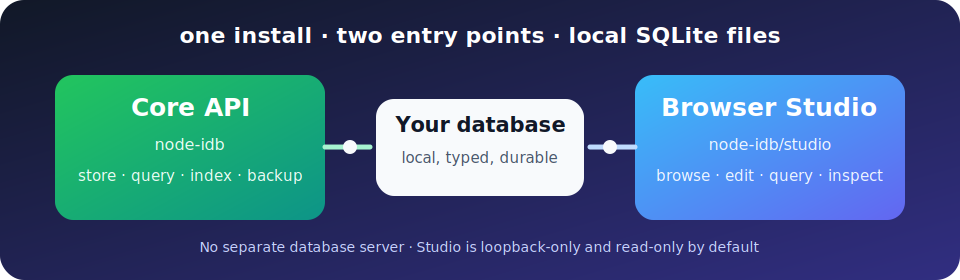

<h1 align="center">node-idb</h1>

<p align="center"><strong>Typed local documents, SQL-style queries, automatic indexing, and a browser Studio—in one npm package.</strong></p>

<p align="center">
  <a href="https://www.npmjs.com/package/node-idb"></a>
  <a href="https://github.com/kbaghini/node-idb/actions/workflows/ci.yml"></a>
  <a href="https://www.npmjs.com/package/node-idb"></a>
  
  <a href="LICENSE"></a>
</p>

<p align="center"></p>

`node-idb` is an embedded, server-side document store for Node.js built on
SQLite. It stores JavaScript-shaped documents locally, preserves useful native
types, and provides a compact document API with a practical SQL-style query
language.

It is designed for applications that want **local, durable, queryable document
storage without operating a separate database server**. It is not intended to
replace PostgreSQL, MongoDB, or another client/server database when data must be
shared across many application servers or written heavily by many processes.

> **Short recommendation:** choose `node-idb` for one Node.js application on
> one machine, low-to-moderate write concurrency, stable document shapes, and
> small or medium documents. Do not choose it for distributed deployments,
> unbounded dynamic field names, very large media documents, or workloads that
> need many simultaneous writers.

## In 30 seconds

| Question                               | Answer                                                                                                                                              |
| -------------------------------------- | --------------------------------------------------------------------------------------------------------------------------------------------------- |
| What is it?                            | A typed document layer over embedded SQLite.                                                                                                        |
| Where does it run?                     | In a Node.js server process, on the same machine as its database files.                                                                             |
| What does it store?                    | Plain objects, nested objects, atomic arrays, strings, finite numbers, booleans, `null`, `BigInt`, `Date`, and binary data.                         |
| How is it queried?                     | `SELECT *` reconstructs complete documents; explicit `SELECT` fields support structured object/array projections, scalar expressions, grouping, and aggregates. |
| Is it transactional?                   | Yes. Each mutation is atomic, including values split between the main and blob databases.                                                           |
| Is it serverless?                      | Yes in the database sense: no database daemon is required. Your Node.js application remains the server for remote clients.                          |
| What is the best workload?             | Local application data, caches, catalogs, configuration, metadata, offline-capable services, and low-to-medium traffic single-host applications.    |
| What is the main scaling boundary?     | SQLite serializes writers to each collection database, and every distinct field path still requires storage structures even when optional query indexes are disabled. |
| What document size is preferred?       | Usually below 100 KB. Documents up to about 1 MB can be reasonable when measured on the target system. Larger documents require deliberate testing. |
| Is there a hard document-size setting? | No single `node-idb` document limit. SQLite, Node.js memory, value encoding, disk capacity, and transaction duration impose the real limits.        |
| Can it open storage without writing?   | The `0.2` API has a genuine `mode: "readonly"` for current, complete disk storage and verified backups.                                           |
| Does it create online backups?         | `backup()` creates integrity-checked, manifested snapshots with per-collection consistency.                                                       |
| Can indexing and open handles be tuned? | Yes. `fieldIndexes` controls optional predicate indexes, and `maxOpenCollections` bounds retained disk collection connections.                    |
| Can an application inspect document shape? | Yes. `structure()` returns an immutable observed type tree for a collection or exact nested field path.                                      |
| Is there a visual management tool?     | The included `node-idb/studio` entry point starts a token-protected, loopback-only browser Studio that is read-only by default.                    |
| How mature is it?                      | It is a young `0.x` package with a comprehensive automated test suite, but it should be evaluated and load-tested before critical production use.   |

## Table of contents

- [In 30 seconds](#in-30-seconds)
- [Start here: five minutes](#start-here-five-minutes)
- [Beginner tutorials](#beginner-tutorials)
- [Who should use it?](#who-should-use-it)
- [Who should not use it?](#who-should-not-use-it)
- [Advantages](#advantages)
- [Tradeoffs, sizing, and limits](#tradeoffs-and-costs)
- [Examples](#examples)
- [Local browser Studio](#local-browser-studio)
- [Public API](#public-api)
- [Statements and results](#statements-and-results)
- [Paths, types, storage, and migration](#paths-wildcards-and-aliases)
- [Performance and production checklist](#performance-controls-and-benchmarks)
- [Project status and support](#project-status-and-support)

<details>
<summary><strong>Which path should I follow?</strong></summary>

- **I want to try it now:** continue to [Start here](#start-here-five-minutes).
- **I am new to document databases:** run the two [beginner tutorials](#beginner-tutorials).
- **I want the visual interface:** jump to [Studio](#local-browser-studio) or its [complete guide](docs/STUDIO.md).
- **I learn from real projects:** open the [Phonebook tutorial](examples/phonebook-studio/).
- **I am evaluating production use:** read [tradeoffs](#tradeoffs-and-costs), [limits](#hard-and-implementation-limits), and the [production checklist](#production-evaluation-checklist).
- **I need exact contracts:** jump to the [public API](#public-api) and [statement reference](#statements-and-results).

</details>

## Start here: five minutes

Install the **single package**. Node.js 20.19 or newer and ESM are required.

```bash
npm install node-idb
```

Create a database, insert one JavaScript-shaped document, and read it back:

```js
import { createIdb } from "node-idb";

const database = createIdb({ storagePath: "./data/my-app" });

try {
  await database.execute("INSERT INTO people", {
    name: "Ada",
    contact: { email: "ada@example.test" },
    tags: ["friend", "engineer"],
    createdAt: new Date(),
  });

  const people = await database.execute(
    "SELECT * FROM people WHERE contact.email = ?",
    ["ada@example.test"],
  );
  console.log(people);
} finally {
  await database.close();
}
```

Open the same data in the included local Studio:

```js
import { startStudio } from "node-idb/studio";

const studio = await startStudio({ rootPath: "./data", port: 0 });
console.log(studio.url); // Open the complete token-bearing URL.
```

Core and Studio have the same package version and release lifecycle. Studio is
a subpath export, not a second dependency: do **not** install a separate Studio
package. It binds only to `127.0.0.1` and starts read-only unless you explicitly
set `writable: true`.

## Beginner tutorials

### 1. Run the smallest possible database example

From this repository or an unpacked npm package:

```bash
node examples/00-beginner.js
```

Read [`examples/00-beginner.js`](examples/00-beginner.js) first. It contains
only factory creation, one insert, one select, and safe shutdown.

### 2. Open the beginner database in Studio

```bash
node examples/00-beginner-studio.js
```

Open the complete printed URL, select `greetings`, and try the Browse,
Structure, Query, and Diagnostics tabs. Press Ctrl+C in the terminal to
stop the server. This example is intentionally read-only.

### 3. Learn with a realistic relational-style document model

```bash
node examples/phonebook-studio/index.js --port=0
```

The [Phonebook Studio tutorial](examples/phonebook-studio/) builds five related
collections and 12,000+ synthetic documents. It teaches nested references,
two-step relation lookup, indexes, structure inspection, querying, editing, and
safe reseeding. For the complete Studio manual, see
[`docs/STUDIO.md`](docs/STUDIO.md).

## Who should use it?

We recommend `node-idb` when most of these statements are true:

- Your Node.js process and the data files live on the same physical machine.
- You want an embedded database with no database server to install or manage.
- Your data is naturally document-shaped but SQL-style filtering, projection,
  grouping, ordering, and aggregation are still useful.
- Document shapes are reasonably stable across a collection.
- Reads are more common than writes, or writes are short and can queue.
- A single application process, or a small number of cooperating processes,
  owns the data.
- You value local files, simple deployment, transactional durability, and easy
  backup over horizontal database scaling.
- You need to retain `Date`, `BigInt`, arrays, nested objects, or binary values
  without manually mapping every value to JSON.
- Your application is a desktop/local service, edge application, small website,
  internal tool, test fixture store, build cache, content catalog, job metadata
  store, or single-host API.

Typical good fits include:

| Use case                                            | Why it fits                                                                                   |
| --------------------------------------------------- | --------------------------------------------------------------------------------------------- |
| Desktop or local-first application backend          | Data stays beside the application and needs no administrator.                                 |
| Embedded device or edge service                     | SQLite is self-contained and works without a database daemon.                                 |
| Small-to-medium single-server API                   | The application server serializes short writes and serves remote clients through its own API. |
| Metadata or content catalog                         | Documents are easy to model and scalar fields remain queryable.                               |
| Configuration, templates, and application resources | Typed nested data and transactional replacement are useful.                                   |
| Local cache of a remote system                      | Low latency, offline reads, and simple invalidation/replacement.                              |
| Tests, prototypes, and development tools            | Isolated storage paths and `:memory:` databases are convenient.                               |
| Migration from the original HIS/EV3 IDB module      | Legacy v0/v2 files and callback behavior are supported.                                       |

## Who should not use it?

We do not recommend `node-idb` when any of these are central requirements:

- Multiple application servers must directly share the same files.
- The database files are on NFS, SMB, a synchronized cloud-drive folder, or
  another network filesystem.
- Many processes must commit writes to the same collection at the same time.
- You need horizontal scaling, replicas, automatic failover, sharding, change
  streams, or multi-region operation.
- You need cross-collection joins, foreign keys between documents, arbitrary
  SQL/DDL, stored procedures, or a complete relational database interface.
- You need a MongoDB-compatible query language or ecosystem.
- You need built-in authentication, authorization, encryption at rest,
  compression, auditing, replication, or remote administration.
- Your documents use arbitrary IDs, timestamps, URLs, or user-provided strings
  as object keys. Use an array of `{ key, value }` entries or a dedicated
  collection instead.
- Individual documents are normally many megabytes or contain videos, large
  archives, or other stream-oriented payloads.
- Large arrays must be filtered or updated by individual element. Arrays are
  atomic values in `node-idb`.
- You need transactions spanning multiple public API calls or multiple
  collections.
- You require a mature `1.x` API and a long public production track record
  today.

For those workloads, consider PostgreSQL, MongoDB, another client/server
database, or object storage combined with a database for metadata. SQLite's own
[appropriate-use guide](https://www.sqlite.org/whentouse.html) makes the same
fundamental distinction: SQLite is strongest when the data is local and writer
concurrency is modest.

## Advantages

- **Zero database-server administration.** Install the npm package and choose a
  storage directory.
- **Document-shaped data.** `SELECT *` reconstructs complete nested plain
  objects, while direct object paths remain structured in mixed projections.
- **Native values.** `Date`, `BigInt`, arrays, buffers, typed arrays, and
  `ArrayBuffer` values round-trip without application-side JSON conventions.
- **Useful SQL concepts.** Predicates, projections, aliases, grouping,
  aggregates, ordering, limits, offsets, expressions, and parameters compose.
- **Transactional writes.** Document replacement and its external blob values
  commit as one crash-atomic SQLite transaction.
- **Predictable alias handling.** Exact paths, leaf-name ambiguity, wildcards,
  and explicit aliases follow documented deterministic rules.
- **Adaptive scalar indexes.** Common equality, range, `IN`, `BETWEEN`,
  `LIKE`, and `GLOB` predicates can use per-field indexes; the default manager
  learns a bounded set automatically, while applications can still pin all,
  none, or a focused collection/path policy.
- **No JSON-only compromise.** Binary data and integers larger than JavaScript's
  safe integer range are preserved.
- **Explicit isolation.** Each `createIdb({ storagePath })` instance owns one
  database directory, making deployment and test boundaries visible.
- **Zero-copy storage migration.** An existing HIS/EV3 project directory can
  become the new instance's `storagePath`; its collection files do not need to
  be copied or renamed.
- **Inspectability.** The physical files remain SQLite databases that standard
  SQLite tools can inspect for diagnostics.
- **Bounded open-handle cache.** Disk engines retain at most 16 collection
  connections by default and transparently reopen least-recently-used
  collections when necessary.
- **Read-only and backup workflows.** A genuine read-only mode and a manifested,
  integrity-checked backup API support safer reporting, validation, and recovery
  procedures.
- **Optional local Studio.** A dependency-free browser interface can discover
  nearby database directories, browse typed documents, build bounded `SELECT`
  queries, inspect diagnostics, and perform explicitly enabled maintenance.

## Tradeoffs and costs

- **One writer per collection database at a time.** Writers wait rather than
  running concurrently. Different collections use different files, but a hot
  collection can still become a write bottleneck.
- **A table-and-structural-index cost per distinct field path.** Every new path
  found in a collection creates a value table and a required structural index.
  Optional query/type indexes are controlled by `fieldIndexes`, but disabling
  them does not remove the underlying per-path schema cost. Stable schemas work
  well; unbounded dynamic keys cause schema growth, slower initialization, more
  disk usage, and more write work.
- **Whole-document mutation cost.** Payload-style updates read, merge, encode,
  and rewrite matched documents. Updating a tiny property in a huge document
  is therefore not cheap.
- **Arrays are atomic.** Their contents are serialized as one value and cannot
  be individually indexed or addressed by the query language.
- **Large text and binary values use fallback query paths.** They are preserved,
  but they do not have the same compact scalar-index behavior as short values.
- **Two files per disk-backed collection.** Backups must preserve the matching
  main and blob files together.
- **No public multi-operation transaction API.** Each `execute()` mutation is a
  transaction; an application cannot currently group several calls into one
  atomic unit.
- **SQL-style, not full SQL.** Statements are compiled against one document
  collection. Cross-collection joins and arbitrary write SQL are intentionally
  outside the public API.
- **Memory is part of the limit.** Documents and atomic arrays are encoded and
  decoded in process. The API does not stream document properties or BLOBs.
- **Predicate indexing increases write amplification.** Adaptive indexing
  deliberately waits for evidence and limits its index budget, but every
  optional index still adds pages and mutation work. Manual `"all"` maximizes
  that cost; focused policies require workload knowledge and benchmarking.
- **Backups are not cross-collection transactions.** Each collection's main and
  blob files are captured consistently, but a backup containing several
  collections can represent slightly different moments in time.
- **Young package.** Version `0.x` means APIs and storage behavior must be
  reviewed carefully before upgrades.

## Document size and shape guidance

The following values are **conservative design guidance, not enforced limits or
performance guarantees**. Hardware, filesystem, cache behavior, query patterns,
write frequency, and Node.js memory settings matter. Benchmark representative
data on the target system before committing to a design.

| Area                                     | Preferred starting point                       | Caution zone                                        | Usually choose another representation                             |
| ---------------------------------------- | ---------------------------------------------- | --------------------------------------------------- | ----------------------------------------------------------------- |
| Complete document                        | Up to roughly 100 KB                           | 100 KB to 1 MB; measure reads and rewrites          | Regularly above 1 MB, especially write-heavy documents            |
| One text or binary property              | Up to roughly 100 KB                           | Hundreds of KB to a few MB                          | Large media, archives, backups, or stream-oriented files          |
| Leaf/path count per document             | Tens; preferably below 100                     | Low hundreds; benchmark write and open time         | Many hundreds or thousands of distinct paths                      |
| Distinct field paths across a collection | Stable and shared by documents                 | Growing into the hundreds                           | Unbounded keys unique to each document                            |
| Atomic array                             | Small or moderate bounded lists                | Large arrays read or replaced as a unit             | Arrays whose elements need queries, indexes, or partial updates   |
| Insert batch                             | Small bounded chunks                           | Hundreds of small documents per call                | Huge batches that create long write locks or high memory pressure |
| Collection database                      | Comfortably fits local disk and backup windows | Multi-GB stores should be load- and recovery-tested | Data that must span machines or approach local operational limits |

### Why 100 KB is a useful starting point

SQLite reports that small BLOBs can be competitive with, and often faster than,
separate filesystem files. Its historical measurements found a crossover around
100 KB on the tested setup, while emphasizing that results vary by system. See
[Internal Versus External BLOBs](https://www.sqlite.org/intern-v-extern-blob.html)
and [35% Faster Than The Filesystem](https://www.sqlite.org/fasterthanfs.html).

For `node-idb`, 100 KB is also a useful application-design boundary because
documents are materialized in JavaScript and payload-style mutations rewrite
the matched document. It is not a cliff: a 300 KB document may work perfectly
for an infrequently updated catalog, while a frequently rewritten 50 KB
document may deserve profiling.

### Guidance for large files

For large images, videos, PDFs, archives, or generated artifacts, prefer:

1. Store the bytes in the filesystem or object storage.
2. Store the URI/path, checksum, MIME type, size, ownership, and searchable
   metadata in `node-idb`.
3. Use atomic file-replacement and application-level cleanup rules so metadata
   and files do not drift apart.

Small thumbnails, compact attachments, and other bounded binary properties can
remain convenient inside `node-idb`. Always test on the actual operating system
and storage device.

### Guidance for dynamic data

Avoid this shape when keys grow without a fixed bound:

```js
{
  readings: {
    '2026-07-19T10:00:00Z': 12,
    '2026-07-19T10:01:00Z': 13,
  },
}
```

Each timestamp becomes a distinct field path. Prefer a bounded array when its
contents are always read as one unit, or separate documents when readings must
be queried:

```js
{ sensorId: 'alpha', timestamp: new Date(), value: 12 }
```

The same rule applies to user IDs, UUIDs, URLs, filenames, and other values that
might otherwise become property names.

## Hard and implementation limits

`node-idb` applies these explicit limits:

| Limit                           | Current behavior                                                                                  |
| ------------------------------- | ------------------------------------------------------------------------------------------------- |
| Collection name                 | 1-128 characters                                                                                  |
| Collection-name characters      | Letters, numbers, underscores, and hyphens; at least one letter, number, or underscore            |
| Storage path                    | Any non-empty filesystem path without a null byte; the operating system supplies practical limits |
| Busy timeout                    | Integer from `0` through `2,147,483,647` milliseconds; defaults to `10,000`                       |
| Open disk collection cache      | Positive safe integer; defaults to `16`; an explicit cap is rejected for `:memory:` storage        |
| Document/array nesting          | Maximum 128 levels                                                                                |
| Field-name dots                 | Rejected because `.` separates nested paths                                                       |
| Field-name null bytes           | Rejected                                                                                          |
| Prototype-sensitive field names | `__proto__`, `prototype`, and `constructor` are rejected                                          |
| Numbers                         | Must be finite JavaScript numbers; use `BigInt` for larger exact integers                         |
| Dates                           | Must contain a valid timestamp                                                                    |
| Object types                    | Only plain objects or objects with a `null` prototype are accepted                                |
| Circular references             | Rejected                                                                                          |

There is no separate `node-idb` maximum for the length of an ordinary field
name or for the number of properties in one document. Those values are bounded
indirectly by SQLite storage, memory, and the 128-level nesting rule. In
practice, very long names waste schema and index space, and large property
counts are expensive because each distinct path creates persistent schema
objects. Keep names concise and field sets bounded even though no small hard
limit is enforced.

SQLite supplies additional upper bounds. `node-idb` does not promise that
values close to these theoretical maxima are practical:

| SQLite boundary                         | Typical/current build value | Effect on `node-idb`                                                                                                                                                      |
| --------------------------------------- | --------------------------- | ------------------------------------------------------------------------------------------------------------------------------------------------------------------------- |
| One string, BLOB, or encoded SQLite row | 1,000,000,000 bytes         | A single long text, binary value, or serialized array must remain below the active SQLite length limit and fit process memory.                                            |
| Result columns / selected terms         | 2,000                       | Extremely wide flat `SELECT` projections can hit the SQLite column limit. Document reconstruction is internally chunked and is not equivalent to one column per property. |
| Bound SQL variables                     | 32,766                      | Extremely large application-supplied parameter lists, especially `IN (...)`, can hit the build's variable limit.                                                          |
| Compound `SELECT` terms                 | 500                         | Very complex generated or raw diagnostic reads can hit this boundary.                                                                                                     |
| Expression depth                        | 1,000                       | Deeply nested SQL expressions can fail even when document nesting is valid.                                                                                               |
| Pages per database file                 | 4,294,967,294               | With a 4 KiB page size this is about 17.6 TB per SQLite file; filesystem and operational limits normally arrive much earlier.                                             |

These values depend on the SQLite build delivered by the installed `sqlite3`
dependency and may change. SQLite documents its defaults and compile-time
options in [Limits In SQLite](https://www.sqlite.org/limits.html). At the maximum
64 KiB page size, SQLite's theoretical file-size ceiling is about 281 TB, but
that is not a sensible capacity target for this package.

There is no small fixed maximum number of documents or collections in
`node-idb`. Real limits include disk space, filesystem file-size limits, schema
size, open file descriptors, available memory, query latency, backup duration,
and recovery objectives. Each disk-backed collection creates two database
files and may hold an open connection while active.

## Concurrency and deployment limits

- Writes are serialized within an engine and by SQLite's file locks.
- SQLite permits only one active writer per collection database file pair.
- A writer waits for `busyTimeoutMs` (10 seconds by default) before a busy
  error is returned.
- Readers use stable SQLite snapshots and do not observe half-written local
  documents.
- Separate collections use separate file pairs, so partitioning unrelated hot
  data into sensible collections can reduce lock contention.
- Long batches and large document rewrites keep the write lock longer and
  reduce effective concurrency.
- Database files should be stored on a local filesystem. Do not place live
  files on a network share or a consumer file-sync folder.
- Remote clients should call your Node.js application API; they should not open
  the SQLite files themselves.

If many writers cannot wait their turn, use a client/server database. SQLite's
[appropriate-use guide](https://www.sqlite.org/whentouse.html) explains this
boundary in detail.

## Operational limitations

`node-idb` currently does not provide built-in:

- Point-in-time recovery, scheduled retention, or remote backup transport
- Replication, clustering, leader election, or failover
- Schema validation or application-level migrations
- Encryption at rest or field-level encryption
- Compression
- User authentication, roles, or row-level permissions
- Change streams, subscriptions, triggers exposed as an API, or reactive events
- Time-to-live indexes or automatic expiry
- Full-text search or vector search
- Geospatial indexes
- Cross-collection joins or foreign-key relationships
- Streaming reads/writes for large properties
- User-controlled transactions spanning multiple calls
- Automatic collection compaction, archival, or retention policies
- A browser IndexedDB implementation; despite its historical name, this is a
  Node.js package backed by SQLite

These features can be implemented at the application layer where appropriate,
but applications that fundamentally depend on several of them should usually
select a database designed around those requirements.

## Backup and recovery

Every disk-backed collection has a matching pair:

```text
db-collection-<collection>.sqlite
db-blobs-<collection>.sqlite
```

Treat the pair as one logical database. The `0.2` API can create a
live, verified backup without exposing a partially populated destination:

```js
const result = await database.backup({
  destinationPath: "./backups/portal-latest",
  integrityCheck: "full",
  overwrite: true,
});

console.log(result.createdAt, result.collections, result.files);
```

The engine stages each backup in a private sibling directory, runs SQLite
integrity checks, calculates sizes and SHA-256 digests, writes the recognition
manifest last, and then promotes the completed directory. See
[`backup(options)`](#backupoptions) for the full contract and consistency
boundary.

For a simple offline filesystem backup instead:

1. Stop writes and call `await database.close()`.
2. Copy both files for every collection in the database directory.
3. Preserve filenames and directory structure.
4. Test restoration periodically rather than assuming a copied backup works.

Do not copy only the main file: long text, arrays, and binary payloads may live
in the matching blob file. A filesystem snapshot remains useful for
storage-level disaster recovery, especially when the application needs one
coordinated snapshot across several independent databases. Always back up
before opening legacy data with a newer package version, and regularly test a
restore rather than treating backup creation as proof of recoverability.

## Examples

The package includes a progression from first use to backups and performance
controls. Run any example from the package root with
`node examples/<file>.js`.

See [examples/README.md](examples/README.md) for the complete guide.

- [00 Beginner: one insert and one select](examples/00-beginner.js)
- [00 Beginner Studio: seed and browse](examples/00-beginner-studio.js)
- [01 Quick start](examples/01-quick-start.js)
- [02 CRUD and mutations](examples/02-crud-and-mutations.js)
- [03 SQL queries and aliases](examples/03-sql-queries-and-aliases.js)
- [04 Typed and binary data](examples/04-types-and-binary-data.js)
- [05 Callback compatibility](examples/05-callback-compatibility.js)
- [06 Separate database instances](examples/06-multiple-projects.js)
- [07 Raw diagnostic reads](examples/07-raw-compatibility-read.js)
- [08 Concurrent writers](examples/08-concurrent-writers.js)
- [09 Backup and read-only mode](examples/09-backup-and-readonly.js)
- [10 Field-index policy and collection cache](examples/10-index-policy-and-cache.js)
- [11 Streaming and operational controls](examples/11-streaming-and-operations.js)
- [12 Verify, restore, and inspect](examples/12-verify-restore-and-inspect.js)
- [13 Automatic indexing](examples/13-automatic-indexing.js)
- [14 Local browser Studio](examples/14-local-studio.js)
- [15 Observed collection structure](examples/15-collection-structure.js)
- [Multi-collection Phonebook Studio project](examples/phonebook-studio/)

## Local browser Studio

`node-idb/studio` is the optional, dependency-free management interface shipped
inside the **same `node-idb` package** as the database API. It is designed for
development, diagnosis, and deliberate local maintenance. It starts a small
pure-Node HTTP server and serves a vanilla browser application; it does not add
Express, Vite, a browser framework, or another runtime dependency.

> New to Studio? Run `node examples/00-beginner-studio.js`, then follow the
> [complete Studio guide](docs/STUDIO.md). For a realistic guided project, use
> the [Phonebook Studio tutorial](examples/phonebook-studio/).

```js
import { startStudio } from "node-idb/studio";

const studio = await startStudio({
  rootPath: "./idbs",
  port: 4177,
});

console.log(studio.url);

// Close the server and every database engine opened by this Studio.
await studio.close();
```

The printed URL contains a cryptographically random access token in its
fragment. A browser fragment is not sent in the HTTP request: the application
stores it for the current tab in `sessionStorage`, removes it from the visible
address, and uses it as a bearer token only for same-origin API calls. Treat
the complete launch URL like a short-lived password. Restart Studio to rotate
it.

The returned handle exposes `url`, `host`, the actual `port`, resolved
`rootPath`, `writable`, a `closed` getter, `refresh()`, and an idempotent async
`close()`. Use `port: 0` when the operating system should choose a free port.

### Studio options

| Option | Default | Meaning |
| --- | --- | --- |
| `rootPath` | Required | Trusted top-level directory. Relative paths resolve when `startStudio()` runs. |
| `port` | `4177` | Local port from `0` through `65535`; `0` selects a currently free port. |
| `writable` | `false` | Enables dedicated insert, update, replace, delete, ANALYZE, and index-optimization endpoints. |
| `maxRows` | `500` | Hard maximum for one query response or document page; configurable through `10_000`. |
| `bodyLimitBytes` | `2 MiB` | Maximum JSON request body; configurable through `64 MiB`. |
| `queryTimeoutMs` | `10_000` | Deadline applied to database work; configurable through ten minutes. |

Studio always binds to `127.0.0.1`. There is intentionally no remote bind
option. Unknown options and unsafe limits are rejected before listening.
Successful JSON responses also have a derived `32 MiB` to `128 MiB` ceiling,
reported as `state.limits.maxResponseBytes`. Query rows and document-page
chunks are encoded incrementally and stop with `response_too_large` before an
unbounded result can accumulate in memory.

Read-only mode can discover storage, browse documents, inspect schemas and
diagnostics, and run bounded canonical `SELECT` queries. Mutation and
maintenance endpoints return `403` even if someone bypasses the browser UI.
`writable: true` must be chosen when the server starts; it cannot be enabled
from the page.

```js
const studio = await startStudio({
  rootPath: "./idbs",
  port: 4177,
  writable: true,
});
```

The query editor remains `SELECT`-only in writable mode. Writes use narrow,
validated forms; delete additionally requires an explicit confirmation. This
separates exploration from mutation and prevents the query editor from
becoming an arbitrary command console. A query must also name exactly one
collection already present in the current Studio catalog; a misspelled or new
collection is rejected without creating files. Refresh the catalog before
querying a collection created by another process.

### Database discovery

Studio inspects the root itself and each immediate child directory. It does
not scan recursively:

```text
idbs/
  db-collection-shared.sqlite       # root database, when present
  db-blobs-shared.sqlite
  development/                      # immediate child database
    db-collection-users.sqlite
    db-blobs-users.sqlite
  production/                       # immediate child database
    db-collection-users.sqlite
    db-blobs-users.sqlite
  archive/
    old/                             # ignored grandchild
```

Only directories recognized by `inspectStorage()` are included. Unrelated and
empty directories are ignored. Child symbolic links and junctions are not
followed, resolved paths must remain within the trusted root, and browser
requests select opaque catalog IDs rather than filesystem paths. A refresh
finds added or renamed child folders and closes engines for entries that
disappeared.

Studio does not create a database merely because an empty child folder exists.
Create at least one collection through `createIdb()`, then refresh:

```js
const database = createIdb({ storagePath: "./idbs/development" });
await database.execute("INSERT INTO settings", {
  key: "theme",
  value: "dark",
});
await database.close();
```

### Interface and typed editing

The interface includes:

- database and collection navigation;
- bounded document pages with expandable, type-aware trees;
- a canonical `SELECT` editor with separate parameters;
- a schema-driven query builder for projections, filters, ordering, and limits;
- insert, deep-merge update, complete replacement, and confirmed deletion when
  write mode is enabled;
- schema, adaptive-index, cache, file-size, and reclaimable-space diagnostics;
- explicit `ANALYZE` and adaptive-index optimization controls.

For a larger interface walkthrough, the
[Phonebook Studio project](examples/phonebook-studio/) deterministically creates
five related collections and more than 12,000 synthetic documents. It includes
bounded insert batches, application-level relationship references, pinned lookup
indexes, rerun protection, and a ready-to-run Studio launcher.

`FIND` is intentionally neither generated nor accepted by Studio. New queries
use the canonical form:

```sql
SELECT person.contact.details, person.name, person.tags
FROM persons AS person
WHERE person.active = ?
ORDER BY person.name
LIMIT 50
```

Query results stop at `maxRows` and report when they were truncated. This is a
safety bound, not a substitute for stable pagination; use `ORDER BY`, `LIMIT`,
and `OFFSET` when page boundaries matter.

Ordinary JSON cannot preserve every node-idb value. Studio therefore uses a
collision-proof tagged transport internally and presents a friendlier Extended
JSON editor. Native values can be written as:

```json
{
  "createdAt": {
    "$nodeIdb": {
      "type": "date",
      "value": "2026-07-21T10:00:00.000Z"
    }
  },
  "counter": {
    "$nodeIdb": {
      "type": "bigint",
      "value": "9007199254740993"
    }
  },
  "bytes": {
    "$nodeIdb": {
      "type": "binary",
      "value": "AAECAw=="
    }
  },
  "items": [1, true, { "nested": "value" }]
}
```

`undefined` uses `{ "$nodeIdb": { "type": "undefined" } }`. It is preserved
inside arrays; like the main API, an object property whose value is
`undefined` is normalized to `null`. The editor can escape a real user object
that would otherwise look like a type marker, so no document key is reserved.
The lower-level `encodeStudioValue()` and `decodeStudioValue()` helpers are
also exported from `node-idb/studio` for tests or custom local clients.

### Studio security and limitations

The server combines loopback binding, a new 256-bit token per launch, strict
`Host` and browser `Origin` validation, same-origin fetches, no-store API
responses, a restrictive Content Security Policy, bounded request bodies,
server-side path selection, sanitized errors, and read-only-by-default engines.
The UI builds DOM nodes with text content rather than injecting result HTML.

These controls make Studio a safer local tool, not a multi-user administration
service. Do not place it behind a reverse proxy, port forward, public hostname,
tunnel, or container port publication. It has no accounts, roles, TLS
termination, tenant isolation, user-level audit identities, or defense against
a malicious process already running as the same operating-system user.

Additional operational boundaries:

- one Studio instance manages one trusted root;
- discovery includes only the root and immediate children;
- opening old storage in writable mode may perform the same supported schema
  migration as `createIdb()`; read-only mode never migrates it;
- pages and request bodies are intentionally bounded, so Studio is not a bulk
  import/export pipeline;
- root arrays can be inserted, browsed, and queried, but the current public
  command API treats an array payload for matched `REPLACE INTO` as ambiguous;
  Studio therefore rejects root-array replacement instead of guessing. Delete
  and insert a new array only when changing its object ID is acceptable;
- replace is atomic and must still find the requested object ID, but Studio
  does not yet attach document revisions or hashes. If another process edits
  the same existing document after it was loaded, the last completed write can
  win; reload before editing data that has concurrent writers;
- write mode is intended for deliberate local corrections, not unattended
  production mutations;
- closing a browser tab does not stop the Node server; call `studio.close()` or
  stop its owning process.

Prefer backups, migrations, application-specific tooling, or direct node-idb
APIs for bulk changes, shared administration, production automation, durable
audit requirements, or secrets that must never be displayed locally.

## Public API

The main package exports `createIdb()` plus the offline `verifyBackup()`,
`restoreBackup()`, and `inspectStorage()` tools. The optional `node-idb/studio`
subpath exports `startStudio()` and its typed transport helpers. Importing
either entry point never creates storage or starts a server, and there is no
global default database.

### `createIdb(options)`

Creates one engine bound to exactly one database directory.

| Option | Default | Meaning |
| --- | --- | --- |
| `storagePath` | Required | Database directory. A relative value is resolved against `process.cwd()` immediately when `createIdb()` runs. Use exactly `":memory:"` for a non-persistent database. |
| `busyTimeoutMs` | `10_000` | How long SQLite waits for a conflicting lock. Must be an integer from `0` through `2_147_483_647`. |
| `durability` | `"strict"` | `"strict"` uses SQLite `synchronous=FULL`; `"balanced"` uses `synchronous=NORMAL` for fewer synchronization operations and weaker power-loss durability. |
| `mode` | `"readwrite"` | `"readonly"` opens existing current-format disk storage through SQLite's read-only mode and permits only reads and backups. |
| `maxOpenCollections` | `16` | Positive safe integer limiting disk collection connections retained by this engine. It is intentionally unavailable for `:memory:` engines. |
| `fieldIndexes` | `"auto"` for new storage | Adaptive `"auto"`, deterministic `"all"`/`"none"`, or an automatic/manual policy. Existing storage keeps its persisted policy when this option is omitted. It cannot be supplied in read-only mode. |

Unknown options are rejected so misspellings do not silently change storage or
durability behavior.

TypeScript callers normally get the strictest option checks by letting
`createIdb()` infer the path literal. For an explicit reusable annotation, pass
that path type to `IdbOptions`, for example
`IdbOptions<"./idbs/main">` or `IdbOptions<":memory:">`. `IdbOptions<string>`
represents a path known only at runtime and therefore exposes only options safe
for both disk and memory engines; disk-only read-only/cache configuration
requires a narrowed non-memory path. Runtime validation remains authoritative
for JavaScript and dynamically constructed values.

```js
import { createIdb } from "node-idb";

const mainDatabase = createIdb({
  storagePath: "./idbs/main",
  busyTimeoutMs: 15_000,
  durability: "strict",
  maxOpenCollections: 16,
  fieldIndexes: "auto",
});

const auditDatabase = createIdb({
  storagePath: "./idbs/audit",
  durability: "balanced",
});
```

Each engine owns every collection below its resolved `storagePath`. Create
separate instances with separate paths when an application needs separate
databases. Within one process, prefer sharing one engine for each resolved
path; separate processes may open the same path and coordinate through SQLite
locking.

For tests or temporary work:

```js
const database = createIdb({ storagePath: ":memory:" });
```

Each in-memory engine is isolated and disappears when closed.

Do not pass `maxOpenCollections` with `:memory:`. A memory collection exists
inside its open SQLite connection, so evicting that connection would erase the
collection. Memory engines therefore retain all collections until `close()`.

### Read-only mode

Use `mode: "readonly"` for reporting, verification, backup sources, or other
workflows that must not alter storage:

```js
const snapshot = createIdb({
  storagePath: "./backups/portal-latest",
  mode: "readonly",
  maxOpenCollections: 4,
});

try {
  const users = await snapshot.execute("SELECT * FROM users WHERE active = ?", [true]);
  const plan = await snapshot.execute(
    "QUERY ON users EXPLAIN QUERY PLAN SELECT * FROM tbl_record",
  );
  console.log(users, plan);
} finally {
  await snapshot.close();
}
```

Read-only mode is deliberately strict:

- It uses SQLite read-only file access in addition to `query_only` protection.
- `SELECT`, the `FIND` compatibility spelling, and read-only
  `QUERY ON ... SELECT|EXPLAIN` work; all
  mutation statements reject before execution. `backup()` is also allowed.
- The storage directory and both files for a requested collection must already
  exist. A miss never creates a directory, collection, or partner file.
- Every opened collection must already use the current schema version (`v5`),
  include its persisted field-index policy, and use the required rollback
  journal mode. Read-only mode will not migrate an old schema, convert WAL,
  reconcile indexes, or normalize legacy metadata. Open such storage once in
  read/write mode after taking an offline filesystem backup, close it, and only
  then open it read-only.
- `mode: "readonly"` cannot be combined with `:memory:`. Do not pass
  `durability` or `fieldIndexes`, because either could require a write.
  `busyTimeoutMs` and `maxOpenCollections` remain valid.

Read-only mode prevents this engine from changing the database; it does not
make the directory an immutable historical snapshot while another engine or
process is writing. Use `backup()` when a durable snapshot copy is needed, and
observe its per-collection consistency boundary.

### Open collection cache

Each disk collection uses one SQLite connection with its blob database
attached. `maxOpenCollections` bounds the number of such collection stores
retained by one engine; it does not limit how many collections can exist on
disk. At the default `16`, accessing a seventeenth collection closes the least
recently used idle store and transparently reopens it when needed. An active
store is never evicted; if every retained store is active, a new acquisition
waits until one is released.

Use a lower value for applications that touch many collections infrequently or
have tight file-descriptor limits. Use a higher value when a stable hot set is
larger than 16 and reopen latency is measurable. Every engine has its own
cache, so several engines for the same path multiply retained connections.
Measure both cache churn and operating-system resource use instead of setting a
very large value by default.

### Field-index policy

Every field path always has a value table and a structural index required for
document reconstruction and mutation. `fieldIndexes` controls two additional
indexes used by common predicates and type-aware lookups. It changes query
plans and write/storage cost, not query correctness: an unindexed predicate
still works by scanning the relevant value table.

The complete option contract is:

```ts
type FieldIndexes =
  | "auto"
  | "all"
  | "none"
  | {
      mode: "auto";
      preset?: "conservative" | "balanced" | "aggressive";
      maxIndexesPerCollection?: number;
      minDocuments?: number;
      minQueryCount?: number;
      slowQueryMs?: number;
      maxResultRatio?: number;
      evaluationInterval?: number;
      cooldownMs?: number;
      allowDrop?: boolean;
      dropUnusedAfterMs?: number;
      minIndexAgeMs?: number;
      rules?: FieldIndexRule[];
    }
  | {
      default?: "all" | "none";
      rules?: FieldIndexRule[];
    };
```

- `"auto"` is the default for newly created storage. It begins with structural
  indexes and learns which optional indexes are justified by observed filters.
- `"all"` creates optional indexes for every field path.
- `"none"` omits every optional field index while retaining required
  structural indexes.
- A policy object's `default` is `"all"` when omitted. Its rules are evaluated
  in array order, and the last matching rule wins.
- `collection` is either one valid collection name or `"*"`. Collection
  matching is case-insensitive; document path matching is case-sensitive.
- A `path` rule is literal. Even a path value of `"*"` means a property
  literally named `*`; use `pattern` for wildcards.
- A `pattern` is a deterministic dot-segment glob: a complete `*` segment
  matches exactly one path segment, while a complete `**` segment matches zero
  or more. Embedded stars, `?`, brackets, and other regular-expression or shell
  syntax are literal. For example, `profile.*` matches `profile.name` but not
  `profile.address.city`; `audit.**` matches `audit` and all descendants.
- Each rule must provide exactly one of `path` or `pattern`, and `enabled` must
  be boolean. Unknown policy/rule keys, empty path segments, and invalid
  collection names are rejected.
- The internal root row has an empty path. It follows `default` and cannot be
  targeted by a document-field rule.
- The policy is normalized and snapshotted when `createIdb()` runs. Mutating a
  caller-owned option object or rules array afterward has no effect.

#### Adaptive automatic indexing

Automatic mode observes canonical field identities after collection aliases
and quoted paths have been resolved. It persists only bounded aggregates:
query counts, predicate categories, elapsed time, result counts, and last-use
times. SQL source, parameter values, aliases, and document contents are never
stored as telemetry.

The balanced default waits for repeated selective filters on a sufficiently
large collection. Evaluation uses frequency, average result ratio, and query
time, creates at most one index per maintenance cycle, enforces a collection
budget and cooldown, and serializes schema changes through the same SQLite
write lock used by document mutations. Several processes can therefore observe
the same storage without independently creating duplicate indexes. Statistics
decay after evaluation so old workloads gradually lose influence and the
telemetry tables remain bounded to one row per field.

```js
// The simple and recommended form for new storage.
const database = createIdb({ storagePath: "./data/application" });

// Optional tuning. Rules are hard overrides and are never auto-managed.
const tuned = createIdb({
  storagePath: "./data/reporting",
  fieldIndexes: {
    mode: "auto",
    preset: "balanced",
    maxIndexesPerCollection: 20,
    rules: [
      { collection: "users", path: "email", enabled: true },
      { collection: "events", pattern: "payload.**", enabled: false },
    ],
  },
});
```

The presets are deliberately different:

- `conservative` waits for larger collections and more evidence, keeps a
  smaller budget, and never removes indexes automatically.
- `balanced`, the default, reacts sooner but also leaves automatic removal off.
- `aggressive` is intended for measured workloads; it uses lower thresholds
  and permits removal after long inactivity and a minimum index age.

`allowDrop` affects only indexes created by the automatic manager. Explicitly
enabled rules cannot be removed, explicitly disabled fields cannot become
candidates, and manual `"all"`, `"none"`, or policy objects never learn or
change themselves. An omitted option preserves the policy already stored in an
existing collection, which prevents package upgrades from silently rebuilding
indexes.

Automatic indexing currently manages the existing per-field value/type index
pair. It does not synthesize compound indexes such as `(tenantId, createdAt)`:
document paths live in separate physical value tables, so true compound
indexing would require a future materialized-projection feature. `ORDER BY`
usage is recorded for diagnostics but does not by itself justify the current
per-field predicate index.

A focused policy normally starts with `default: "none"` and enables only fields
used by selective filters or ordered/range query plans confirmed by
measurement:

```js
const database = createIdb({
  storagePath: "./data/application",
  fieldIndexes: {
    default: "none",
    rules: [
      { collection: "*", path: "tenantId", enabled: true },
      { collection: "users", path: "email", enabled: true },
      { collection: "events", pattern: "context.**", enabled: true },
      // Later and more specific: exclude private event context again.
      { collection: "events", pattern: "context.private.**", enabled: false },
    ],
  },
});
```

#### Persisted schema-v5 behavior

The normalized policy and adaptive metadata are persisted inside every collection as schema-v5
metadata. On read/write open, the requested policy becomes that collection's
active persisted policy and existing optional indexes are created or dropped to
match it. Data is not rewritten, but reconciliation is schema work: on a large
or wide collection it can take locks, consume time and temporary disk space,
and make the next open slower. Back up first and roll out policy changes as an
operational migration. Dropping indexes makes their pages reusable inside
SQLite but does not necessarily shrink the database file; node-idb does not run
`VACUUM` automatically.

New field paths follow the currently persisted policy. Engines that share a
storage path also share that policy; do not keep concurrent engines configured
with different policies. The latest read/write initialization can replace the
persisted policy, cause index churn, and change which indexes later writers
create. Use one policy per storage path across every process.

Read-only engines load and validate the persisted policy instead of accepting a
new one. Legacy schema versions must first be upgraded by a read/write engine.
Backups preserve the schema version, policy metadata, and current indexes.

Choose `"all"` for convenience, smaller/stable schemas, or query-heavy data;
choose `"none"` for write-heavy data with few selective predicates; choose a
focused policy for established workloads. Do not assume fewer indexes are
faster overall: scans can dominate. Use the packaged benchmark and production-
shaped load tests before changing the policy.

### `execute(statement, parameters?, options?)`

Returns the direct operation result and rejects on an error.

```js
const controller = new AbortController();
const files = await database.execute("SELECT * FROM files WHERE key = $key", {
  $key: "main.js",
}, {
  timeoutMs: 2_000,
  signal: controller.signal,
});
```

`options.signal` cancels queued or running work and rejects with an
`AbortError`. `options.timeoutMs` creates an execution deadline and rejects
with a `TimeoutError` whose code is `IDB_TIMEOUT`. Cancellation interrupts the
active SQLite statement. A mutating command is rolled back; the collection
connection remains reusable. Both options are cooperative around filesystem
and JavaScript work, so an already-running synchronous callback cannot be
preempted until control returns to node-idb.

For `UPSERT INTO` and `REPLACE INTO`, `options.requireMatch: true` disables the
normal insert-on-miss behavior. Selection and the decision not to insert occur
inside the same mutation transaction; a miss returns `[]`. This is useful for
edit screens that must never create a document after a concurrent deletion:

```js
const replaced = await database.execute(
  "REPLACE INTO users WHERE object_id = 42",
  { name: "Updated user", active: true },
  { requireMatch: true },
);

if (!replaced.length) console.log("The document no longer exists");
```

`requireMatch` is rejected for other statements so a misplaced safety option
cannot be silently ignored. It does not change the existing array-payload
ambiguity: matched upsert/replace payloads must still be one non-array document.

### `stream(statement, parameters?, options?)`

Returns an `AsyncIterable` for projected rows or complete documents from
`SELECT`. Results are fetched in bounded pages and only one unread page is
buffered, so a slow consumer applies backpressure instead of accumulating the
complete result in memory. The query keeps one stable SQLite snapshot until
iteration finishes.

```js
for await (const document of database.stream(
  "SELECT * FROM events WHERE tenantId = ? ORDER BY createdAt",
  [tenantId],
  { batchSize: 250, timeoutMs: 30_000, signal: controller.signal },
)) {
  await sendToArchive(document);
}
```

`batchSize` defaults to `100` and accepts `1` through `10_000`. Breaking a
`for await` loop releases the snapshot and collection lease. Always finish,
break, or explicitly call `return()` on a manually consumed iterator; leaving
an iterator open also leaves its snapshot active, and `close()` correctly waits
for that active operation.

### `run(statement, parameters?, callback?)`

The Promise form is a compatibility API that always resolves an envelope. The
two Node-style callback overloads still work, but are deprecated:

```js
const outcome = await database.run("SELECT * FROM files");
// { error: null, result: [...] } or { error, result: undefined }

database.run("SELECT * FROM files", (error, result) => {});
database.run(
  "SELECT * FROM files WHERE key=?",
  ["main.js"],
  (error, result) => {},
);
```

The first callback use in a process emits a `DeprecationWarning` with code
`NODE_IDB_RUN_CALLBACK`. Callback support is retained throughout the `0.x`
release line so existing applications can migrate deliberately; it will not be
removed in a `0.x` update. New code should use `execute()`. Callers that need
the non-throwing envelope can keep using the Promise form of `run()`, which is
not deprecated.

### `structure(collection, options?)`

Returns an immutable **observed structure**, not a declared or enforced schema.
It reads the current collection metadata and stored values in one stable
snapshot, reconstructs the object-field hierarchy, and reports exact logical
type counts, coverage, optionality, nesting depth, and current physical
predicate-index status.

```js
const complete = await database.structure("people");
console.dir(complete, { depth: null });

const contact = await database.structure("people", {
  path: "contact.details",
  timeoutMs: 10_000,
  signal: controller.signal,
});

console.log(contact.root.path);                 // contact.details
console.log(contact.root.types);                // [{ type: "object", count: 80 }]
console.log(contact.root.children[0].coverage); // fraction of all documents
```

The result has this shape:

```text
CollectionStructure
  collection, path, documentCount, fieldCount, maxDepth
  root
    name, path, depth
    types: [{ type, count }]
    presentInDocuments, coverage, optional
    coverageWithinParent, optionalWithinParent
    indexed
    children: [...same node shape]
```

`path` is an exact, case-sensitive canonical document path such as
`"contact.details"`. It is not a SQL alias and must not include the collection
name. Supplying a path restricts type counting and the returned tree to that
field and its descendants, which is especially useful for large or wide
collections. A missing collection or path rejects and never creates storage.

Important interpretation details:

- `coverage` is the fraction of all collection documents containing the field.
- `coverageWithinParent` uses only parent values observed as objects. This
  distinguishes a child that is always present inside an optional object from a
  child that is itself optional inside that object.
- `optional` is collection-wide; `optionalWithinParent` is relative to the
  parent objects.
- Mixed document shapes produce several entries in `types`; booleans and short
  or long strings are combined into their logical `boolean` and `string` types.
- Stored `undefined` and `null` are both reported as `null` because node-idb's
  document storage intentionally represents them with the same value type.
- Arrays are atomic values. Their elements are preserved and returned by
  document reads, but array-internal object keys are not collection field paths
  and therefore do not appear as structure children.
- Field metadata is historical. If every document stops using a previously
  observed path, that node remains visible with no types and zero coverage.
- `indexed` reports the index that physically exists now, including pinned or
  automatically managed indexes; it is not merely the configured policy.

Exact type and coverage counts scan the value table for every returned field.
Use the focused `path` option, a suitable timeout, and a quiet operational
window when inspecting extremely large or very wide collections. The method is
available in read/write and genuine read-only engines and never mutates data.

### `backup(options)`

Creates a complete staged backup for all collections, or a selected non-empty
set, and resolves only after its SQLite files, integrity checks, hashes,
manifest, and destination promotion succeed. It works from read/write and
read-only engines backed by the filesystem; `:memory:` engines are rejected.
An engine whose storage contains no complete collection/blob file pair also
rejects instead of publishing an empty backup.

| Option | Default | Meaning |
| --- | --- | --- |
| `destinationPath` | Required | New backup directory. Relative paths resolve against `process.cwd()` when `backup()` runs. It must not equal, contain, or be contained by the source path; physical/symlink overlap is also rejected. A filesystem root is never accepted. |
| `overwrite` | `false` | When false, any existing destination rejects. When true, replacement is allowed only if the existing real directory contains a valid node-idb recognition manifest. A destination without that recognition data is never overwritten. |
| `integrityCheck` | `"quick"` | `"quick"` runs SQLite `quick_check`; `"full"` runs the more thorough and usually slower `integrity_check` on every copied main and blob file. |
| `collections` | All discovered collections | Optional non-empty collection-name array. Names are case-insensitive, must exist, and must not contain duplicate identities. Each selected collection includes both files. |
| `signal` | None | Optional `AbortSignal`, checked cooperatively while files are copied, verified, and hashed, and immediately before manifest/promotion. A detected cancellation rejects, attempts to discard the private stage, and leaves the destination unchanged. If stage removal itself fails, an `AggregateError` reports both failures and identifies the retained stage. Once destination promotion begins, cancellation does not roll it back. |

```js
const controller = new AbortController();

const backup = await database.backup({
  destinationPath: "./backups/reporting",
  collections: ["users", "orders"],
  integrityCheck: "full",
  overwrite: true,
  signal: controller.signal,
});

// Absolute path, ISO timestamp, sorted collection names, and two entries per
// collection (main plus blobs), each with byte length and SHA-256 digest.
console.log(backup.destinationPath);
console.log(backup.createdAt);
console.table(backup.files);
```

The frozen result has this shape:

```ts
interface BackupResult {
  readonly destinationPath: string;
  readonly createdAt: string;
  readonly collections: readonly string[];
  readonly files: readonly {
    readonly collection: string;
    readonly kind: "collection" | "blobs";
    readonly filename: string;
    readonly bytes: number;
    readonly sha256: string;
  }[];
}
```

The destination also contains `.node-idb-backup.json`. Its recognition data
includes `format`, `formatVersion`, `createdAt`, the node-idb and SQLite
versions, `consistency: "per-collection"`, sorted collection identities, and
the same file metadata. The manifest is written last inside the private stage.
It makes guarded `overwrite: true` possible and gives restore tooling sizes and
digests to verify; it is not a signature and does not provide authenticity.

For a guarded overwrite, node-idb requires the existing directory to contain
exactly the manifest and every file it declares. It verifies each file's type,
size, SHA-256 digest, canonical main/blob pairing, and SQLite integrity before
staging and again while atomically claiming the old directory; missing,
renamed, modified, malformed, symlinked, or untracked entries make promotion
reject. The newly published directory is verified again after its rename. If
that last check fails, the rejected copy is quarantined at a reported sibling
path and a displaced old backup is restored. The old recognized backup is
moved aside only after the new stage is complete and is also restored if the
promotion itself fails; in the rare event that both promotion and rollback
fail, the thrown error reports the paths that require inspection. If promotion
succeeds but cleanup of the displaced backup fails, the call rejects even
though the new destination is complete; that error identifies the cleanup
sibling, which may still contain all or part of the previous backup.

#### Backup ordering and consistency

A backup is exclusive relative to calls made through the same engine: it waits
for earlier operations, later operations wait for it, and `close()` waits for
it. For each collection, the main and attached blob databases are held on one
stable read transaction while both files are copied, so that pair represents a
consistent collection snapshot. SQLite integrity checking is then applied to
each output file.

That stable snapshot can temporarily block external writers to the collection
while its pair is being copied. Backup lock retries honor the engine's
`busyTimeoutMs`; heavy concurrent writes can therefore delay the backup or make
it reject with a busy/locked error after the configured deadline. Schedule
large backups for quieter periods and test their effect on write latency.

There is intentionally no cross-collection transaction. Collections are copied
one after another, and writers using another engine or process may commit
between them. Consequently, `consistency: "per-collection"` is not a promise
that every collection represents the same instant. If the application requires
a global business-level checkpoint, pause all writers or coordinate them at the
application layer before calling `backup()`.

The completed backup directory can be opened directly with
`createIdb({ storagePath: backup.destinationPath, mode: "readonly" })`. For a
production restore, stop every reader/writer and use the verification and
restore APIs below. The API does not schedule backups, enforce retention,
upload snapshots, authenticate manifests, encrypt files, or provide
point-in-time log replay.

### `verifyBackup(options)` and `restoreBackup(options)`

These standalone functions do not require an open engine. `verifyBackup()`
validates the manifest, exact directory contents, canonical file pairs, sizes,
SHA-256 digests, and SQLite integrity. `restoreBackup()` verifies first, copies
into a private sibling stage, verifies that stage, and atomically promotes it.

```js
import { restoreBackup, verifyBackup } from "node-idb";

await verifyBackup({ backupPath: "./backups/main", integrityCheck: "full" });
await restoreBackup({
  backupPath: "./backups/main",
  destinationPath: "./data/restored-main",
  integrityCheck: "full",
});
```

Restore is intentionally conservative. The destination must be absent unless
`overwrite: true`; even then, only a directory with a valid node-idb backup
manifest can be replaced. Arbitrary directories and unmanifested live storage
are never overwritten. Restore to a new path, validate the application against
it, then change the application path while writers are stopped. Both functions
accept an `AbortSignal`; `integrityCheck` defaults to `"quick"` and can be
`"full"`.

### Diagnostics and maintenance

`diagnostics()` reports the engine state, schema version, configured policy,
active operation count, discovered collections, open collection leases, cache
limit/waiters, cumulative LRU evictions, and per-collection automatic-index
candidates, managed indexes, scores, reasons, and errors. `storageStats()` reports actual
file sizes, SQLite page allocation, free pages, and estimated reclaimable
bytes per main/blob database.

```js
console.dir(await database.diagnostics(), { depth: null });
console.dir(await database.storageStats({ collections: ["events"] }), {
  depth: null,
});

await database.analyze({ collections: ["events"] });
await database.vacuum({ collections: ["events"], timeoutMs: 60_000 });

// Inspect the next eligible action without changing the schema.
console.dir(await database.optimizeIndexes({
  collections: ["events"],
  dryRun: true,
}), { depth: null });

// Evaluate immediately and apply at most one safe action per collection.
await database.optimizeIndexes({ collections: ["events"] });
```

`optimizeIndexes()` flushes pending observations and evaluates automatic
policies immediately. `dryRun: true` may persist the observations already
produced by completed queries, but it never changes indexes. Manual policies
return `mode: "manual"` with no action.

node-idb automatically invokes SQLite `PRAGMA optimize` when a writable
collection opens, after an automatic schema change, periodically for active
long-lived stores, and before close. This bounded planner maintenance replaces
the need to routinely call full `analyze()`; that method remains available for
explicit operational work. `vacuum()` rewrites both files
and can require substantial temporary disk space and exclusive locks; it is
never automatic. Both reject on read-only engines and accept optional
`collections`, `signal`, and `timeoutMs`. Run maintenance during a quiet period
after a verified backup.

### `inspectStorage(options)` and the CLI

`inspectStorage()` discovers and validates file pairs without migrating them.
It reports schema versions, persisted index policies, paths, and sizes;
`integrityCheck` is `"quick"` by default and also accepts `"none"` or `"full"`.

The installed `node-idb` command exposes the same offline workflow:

```bash
node-idb inspect ./data/main --integrity full --json
node-idb verify-backup ./backups/main --full --json
node-idb restore ./backups/main ./data/restored-main --full
node-idb migrate ./data/main --yes --field-indexes auto
```

`migrate` first performs a read-only integrity inspection, opens each discovered
collection through the current writable engine to apply supported migrations,
closes it, and inspects again. It requires `--yes`; this is a guard, not an
automatic backup. Stop all processes and create a verified backup yourself
before running it. Inspection and verification never migrate.

### `close()`

Waits for active operations, closes every collection handle, and permanently
closes the engine. Repeated `close()` calls return the same closing result.
Later `execute()` calls reject and `run()` calls resolve an error envelope;
create a new instance to reopen the database.

## Statements and results

| Statement | Behavior | Result |
| --- | --- | --- |
| `INSERT INTO collection` | Inserts one payload, or a batch when the payload is an array | object ID, or an array of IDs |
| `SELECT * FROM collection ...` | Reconstructs complete typed documents | document array |
| `SELECT fields FROM collection ...` | Projects structured objects/arrays, scalar fields, expressions, or aggregates | row array |
| `FIND collection ...` | Compatibility spelling for `SELECT * FROM collection ...` during `0.x` | document array |
| `UPDATE collection ...` + payload | Deep-merges the payload into every match | `{ object_id }[]` |
| `UPDATE collection SET ...` | Evaluates SQLite expressions, then replaces assigned paths | `{ object_id }[]` |
| `UPSERT INTO collection WHERE ...` | Deep-merges matches or inserts a miss | `{ object_id, inserted? }[]` |
| `REPLACE INTO collection WHERE ...` | Replaces matches completely or inserts a miss | `{ object_id, inserted? }[]` |
| `UNSET fields FROM collection ...` | Removes selected paths and rewrites each match | `{ object_id }[]` |
| `DELETE FROM collection ...` | Deletes complete matching documents | `{ object_id }[]` |
| `QUERY ON collection ...` | Runs a physical read-only `SELECT` or `EXPLAIN` for diagnostics | physical row array |

`UPSERT INTO` and `REPLACE INTO` require a `WHERE` clause. This prevents an
accidental operation from merging into or replacing every document when the
caller intended an insert. Use `INSERT INTO` for unconditional insertion.

An array is a batch payload on an insert or on an upsert/replace miss. It is
rejected when a payload-style `UPDATE`, `UPSERT INTO`, or `REPLACE INTO`
already has matches, because treating the same array as both SQL bindings and
one mutation payload would be ambiguous and potentially destructive.

`SELECT *`, its `FIND` compatibility spelling, mutation selectors, and `UNSET`
support filtering, ordering, and pagination. Complete-document selection
rejects `DISTINCT`, `GROUP BY`, and `HAVING`; select explicit scalar fields for
grouped or aggregate results. `UPDATE`, `UNSET`, and `DELETE` without `WHERE`
intentionally affect every document, so build those statements carefully.

`SELECT` is the canonical read command. A lone bare `*`, or a lone real table
alias such as `person.*`, returns complete documents without exposing the
internal `object_id`:

```sql
SELECT person.*
FROM persons AS person
WHERE person.active = ?
ORDER BY person.name
```

An exact object path is reconstructed instead of returning its physical child
count. It composes with scalar and atomic-array projections:

```sql
SELECT person.contact.details AS details, person.name, person.tags
FROM persons AS person
```

That query can return `{ object_id, details: { ... }, name, tags: [...] }`.
Nested values inside `details`, including `Date`, `BigInt`, arrays, and binary
data, retain their document types. A path may hold an object in one document,
an array or scalar in another, and be null or absent elsewhere; each row is
decoded according to its own stored type, with an absent projection reported
as `null`.

`FIND persons ...` remains a thin compatibility rewrite to
`SELECT * FROM persons ...` throughout `0.x`; it has no separate query or
reconstruction implementation. New code and all packaged examples use
`SELECT`.

`WHERE`, logical/comparison operators, `IN`, `BETWEEN`, `LIKE`, `GLOB`,
`ESCAPE`, `IS NULL`, grouping, `HAVING`, aggregates, `DISTINCT`, ordering,
limits, offsets, `CASE`, and safe SQLite scalar functions compose through the
SQL compiler. SQL keywords used as collection or field names must be quoted:

```sql
SELECT entry.`order`, entry.`shipping-address.zip-code`
FROM `order-log` AS entry
WHERE entry.`group` = ?
```

Non-aggregate, non-`DISTINCT` explicit field/expression projections include
`object_id` unless it is explicitly selected. Complete-document `SELECT *`
never exposes the internal ID. Aggregates and `DISTINCT` do not receive an
implicit ID. An explicit ID alias is honored:

```sql
SELECT item.object_id AS "DocumentID", item.name FROM items AS item
```

## Parameters

Positional placeholders receive an array. Named `$name` placeholders receive
an object whose key may be `$name` or `name`; the dollar-prefixed key wins even
when its value is `null`.

```js
await database.execute("SELECT * FROM users WHERE age >= ? AND active = ?", [
  18,
  true,
]);
await database.execute("SELECT * FROM users WHERE email = $email", {
  $email: "user@example.test",
});
```

Direct `SET` parameters preserve native document types, including `Date`,
`BigInt`, buffers, arrays, and plain objects. Assigning one field directly to
another also preserves its logical type. Formula results use SQLite result
types:

```js
await database.execute(
  "UPDATE users SET profile=$profile, visits=visits+1 WHERE id=$id",
  { $id: 7, $profile: { theme: "dark" } },
);
```

## Paths, wildcards, and aliases

Dots represent object nesting and are therefore rejected inside actual field
names. Quoting a dotted name refers to that exact stored path; it does not turn
the dot into a literal key.

- A lone `*`, or a lone real table-qualified `alias.*`, reconstructs complete
  documents.
- `?` selects immediate top-level fields as a flat projection.
- `profile.?` selects immediate children of `profile`.
- `profile.*` selects every descendant of the stored `profile` path as flat
  columns. It is a complete-document selector only when `profile` is the real
  table alias in that statement.

The same path wildcards work in `UNSET` field lists, except a bare `*` is
rejected because complete documents must be removed with `DELETE FROM`.

Alias resolution is deterministic:

1. An explicit `AS` alias wins and its source spelling is preserved.
2. An exact dotted path wins over leaf matching.
3. A unique bare leaf resolves wherever it is nested.
4. An ambiguous bare leaf projects every match under full-path aliases.
5. Ambiguous positive predicates match any path; negative predicates require
   every matching path to satisfy the negative condition.
6. Exact matching is attempted first, followed by a case-insensitive fallback.

Output aliases must be unique case-insensitively. Duplicate explicit or
implicit aliases are rejected instead of allowing the SQLite driver to
silently overwrite one projected value.

For example, if both `home.city` and `work.city` exist, `SELECT city` returns
both keys. Use `SELECT home.city AS residence` for one stable output name.

## Stored and selected types

`SELECT *` reconstructs the logical document. Explicit scalar projections keep
SQLite-compatible behavior, while direct objects and blob-backed payloads are
decoded structurally.

| Input                                           | `SELECT *` / inside projected object | Direct explicit projection              |
| ----------------------------------------------- | ------------------------------------ | --------------------------------------- |
| `null` / property `undefined`                   | `null`                               | `null`                                  |
| boolean                                         | boolean                              | `0` or `1`                              |
| finite number                                   | number                               | number                                  |
| `BigInt`                                        | `BigInt`                             | decimal string                          |
| valid `Date`                                    | `Date`                               | epoch milliseconds                      |
| string / long text                              | string                               | string                                  |
| array                                           | array, including nested typed values | array, including nested typed values    |
| plain object                                    | nested object                        | complete reconstructed object           |
| `Buffer`, typed array, `ArrayBuffer`, or `Blob` | `Buffer`                             | `Buffer`                                |

Direct object result terms do not support `DISTINCT`, `GROUP BY`, `HAVING`, or
mixed aggregate results because deep object equality is not represented by one
SQLite scalar. Select scalar descendants for those operations. Atomic arrays
remain single values and can participate in ordinary `DISTINCT` or grouping.
Object reconstruction applies to direct result paths; use scalar descendants
inside SQL functions, predicates, and ordering expressions.

Arrays are atomic values rather than queryable child collections. `undefined`
inside an array is preserved. Binary values inside arrays are base64-encoded as
part of the array's JSON representation, which increases their encoded size.
Circular references, non-finite numbers, invalid dates, unsupported class
instances, prototype-sensitive keys, literal dots, and excessive nesting are
rejected before commit.

Blob-backed rows whose external payload is missing are reported as an integrity
error rather than silently decoded as empty data.

## Storage, migration, and durability

`storagePath` is the database directory itself:

```text
<storagePath>/
  db-collection-<collection>.sqlite
  db-blobs-<collection>.sqlite
```

The directory is created lazily on the first collection access. Relative paths
are resolved once, when `createIdb()` is called, so a later
`process.chdir()` cannot redirect an existing instance. Pass exactly
`":memory:"` to avoid filesystem storage.

Collection identities are case-insensitive on every platform: `Users`,
`users`, and `USERS` address the same collection. New database filenames use
the lowercase identity. Existing legacy filenames with other casing are found
and opened in place; if several files differ only by collection-name casing,
opening is rejected instead of choosing an ambiguous file.

### Zero-copy migration from project-scoped versions

Earlier versions stored each project's files in a child of the configured
root. For example, the `portal` database beneath a former `./idbs` root already
lives in `./idbs/portal`. Point the new instance directly at that existing
child directory:

```js
const database = createIdb({ storagePath: "./idbs/portal" });
await database.execute("SELECT * FROM users");
```

Repeat this for every old project directory that the application uses. Legacy
populated v0/v2 collection and blob files are opened and upgraded in place;
document IDs and filenames are retained. Take a complete backup before the
first open with the new version.

For application code, import the named factory, construct one engine per old
project directory, remove the former project argument from each method call,
and use only the canonical statements in [Statements and results](#statements-and-results).
Treat `close()` as terminal and construct a new engine when reopening is
required.

Main and blob databases are attached to one SQLite connection. Disk-backed
stores use rollback journals, allowing SQLite's multi-file transaction
mechanism to coordinate the collection and blob files. `durability: "strict"`
is the default and uses `synchronous=FULL`. `durability: "balanced"` uses
`synchronous=NORMAL`, reducing synchronization work while accepting a greater
chance of losing the latest committed transaction after an operating-system or
power failure.

Writes use `BEGIN IMMEDIATE`, the configured busy timeout, an in-process queue,
and a catalog refresh after acquiring the write lock. Read/modify/write
operations are one transaction, and multi-query document reads use a stable
snapshot.

Common scalar equality, range, `IN`, `BETWEEN`, `LIKE`, and `GLOB` predicates
can use optional per-field indexes when the persisted `fieldIndexes` policy
enables them. Disabled indexes and blob-backed long text, array, and binary
values retain semantically equivalent scan/fallback paths. Wide result reads
are internally chunked below common SQLite bind and compound-query limits.

As with every in-place database upgrade, take a filesystem backup before the
first production deployment.

## Performance controls and benchmarks

`fieldIndexes`, `maxOpenCollections`, and `durability` trade read latency,
write cost, retained resources, and failure guarantees against one another.
There is no universally fastest combination. The repository includes a
deterministic harness covering batched inserts, indexed point reads, ordered
range reads, updates, and collection-cache churn.

From a development checkout:

```bash
# Small smoke run
npm run benchmark:quick

# Standard comparison workload
npm run benchmark

# Larger workload
node benchmarks/run.js --preset stress
```

Compare policies directly on the same idle machine and storage class:

```bash
node benchmarks/run.js --field-indexes all --max-open-collections 32
node benchmarks/run.js --field-indexes focused --max-open-collections 8
node benchmarks/run.js --field-indexes none --max-open-collections 4
node benchmarks/run.js --preset standard --json > benchmark.json
```

Run `node benchmarks/run.js --help` for workload, seed, durability, storage,
and report controls. The `focused` benchmark policy indexes exactly the fields
used by its predicates; application policies must reflect application queries.
See the [benchmark guide](benchmarks/README.md) for safe storage behavior,
repeatable comparisons, report contents, and interpretation. These synthetic
results are a regression and trade-off tool, not a capacity claim or a
substitute for production-shaped load, contention, backup, and recovery tests.

## Raw diagnostic reads

`QUERY ON` runs a physical read against one collection connection:

```sql
QUERY ON files SELECT id, name FROM tbl_fields ORDER BY id
```

Only `SELECT` and `EXPLAIN` are accepted. Raw reads share the engine's snapshot
queue, so they cannot observe a local document halfway through replacement.
These statements expose implementation tables whose schema can change and
should be limited to diagnostics, migrations, and carefully versioned tooling.

## Production evaluation checklist

Before adopting `node-idb` for production:

1. Model dynamic keys as values or separate documents.
2. Generate representative documents and measure insert, query, update, and
   startup time at expected and 2-5x expected volume.
3. Test the largest document, array, binary value, and batch you will accept.
4. Test concurrent writers and choose an appropriate `busyTimeoutMs`.
5. Compare representative `fieldIndexes` policies and set
   `maxOpenCollections` from the measured hot set and process resource limits.
6. Set application-level maximum sizes for documents, arrays, strings, binary
   values, query limits, and batches. Do not expose SQLite's theoretical limits
   to untrusted input.
7. Put storage on a local durable filesystem with sufficient free-space
   monitoring.
8. Define and test backup, manifest/hash verification, restore, retention, and
   corruption-response procedures for both files in every collection pair.
9. Decide how encryption, authentication, authorization, and audit logging are
   handled outside the package.
10. Pin and review package upgrades; back up before opening production files with
   a new version.
11. Reconsider a client/server database if write concurrency, dataset size, or
     multi-host requirements are likely to grow materially.

## Project status and support

`node-idb` is currently a `0.x` package. Its test suite covers the public API,
SQL behavior, typed values, legacy migration, concurrency, corruption
detection, aliasing, wide reads, field-index reconciliation, collection-cache
eviction, genuine read-only access, and manifested backups. Tests reduce risk
but do not replace application-specific load, failure, and recovery testing.

Report reproducible defects and documentation gaps through the repository's
[GitHub issues](https://github.com/kbaghini/node-idb/issues).

- See [CONTRIBUTING.md](https://github.com/kbaghini/node-idb/blob/master/CONTRIBUTING.md) before proposing a change.
- Report security issues according to [SECURITY.md](https://github.com/kbaghini/node-idb/blob/master/SECURITY.md), not in a
  public issue.
- Version history and release notes are available in
  [CHANGELOG.md](https://github.com/kbaghini/node-idb/blob/master/CHANGELOG.md) and [GitHub Releases](https://github.com/kbaghini/node-idb/releases).

## License

MIT
