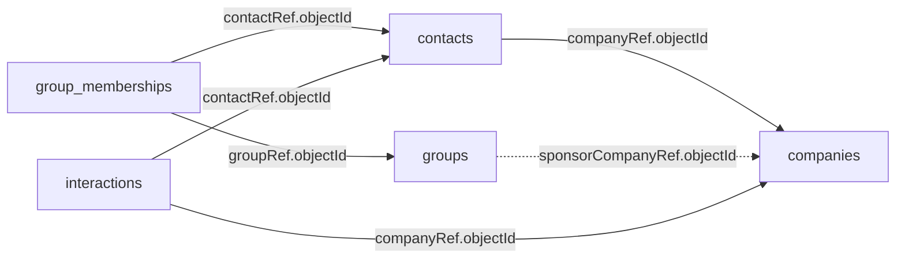

# Phonebook Studio tutorial

> **Goal:** learn node-idb and its included Studio through a realistic,
> deterministic, multi-collection application—without needing any real data.

This sample creates a realistic, deterministic phonebook database and opens the
local node-idb Studio over it. It is intentionally larger than the short
examples so paging, nested values, relationship lookups, field indexes,
diagnostics, and write forms are easy to review.

The standard dataset contains **12,276 review data documents**, plus one
`phonebook_meta` success marker used for safe reruns:

| Collection | Documents | Purpose |
| --- | ---: | --- |
| `companies` | 60 | Organizations, addresses, dates, labels, BigInt revenue, and a small binary value |
| `groups` | 16 | Personal/business groups, optionally referring to a sponsor company |
| `contacts` | 1,500 | People with nested job/address/preferences objects, phones, tags, dates, and a company reference |
| `group_memberships` | 3,200 | Many-to-many bridge between contacts and groups |
| `interactions` | 7,500 | Calls, messages, meetings, notes, outcomes, and follow-up data referring to contacts and companies |

All people, companies, dates, and interactions are synthetic. The same seed and
counts produce the same logical data, although node-idb `object_id` values can
change after reseeding.

## Contents

- [What this tutorial teaches](#what-this-tutorial-teaches)
- [Run it](#run-it)
- [Five-minute Studio tour](#five-minute-studio-tour)
- [Relationship model](#relationship-model)
- [Safe reruns and reseeding](#safe-reruns-and-reseeding)
- [Relationship walkthrough in Studio](#relationship-walkthrough-in-studio)
- [Structure and type exercise](#structure-and-type-exercise)
- [Safe write exercise](#safe-write-exercise)
- [Indexes to inspect](#indexes-to-inspect)
- [Code map](#code-map)

## What this tutorial teaches

By the end, you will have reviewed:

- separate collections for entities and many-to-many relationships;
- nested application-level references built from returned `object_id` values;
- complete-document and projected `SELECT` queries with parameters;
- object, array, date, BigInt, and binary value rendering;
- Tree and List structure views, optional paths, type counts, and coverage;
- pinned relationship indexes plus adaptive indexing candidates;
- bounded document paging, diagnostics, typed write forms, and safe reseeding.

## Run it

From the package root:

```bash
node examples/phonebook-studio/index.js --port=0
```

The first run generates the data below
`./.example-data/phonebook-studio/phonebook`, then prints a token-protected URL.
Keep the terminal running and open the **complete** URL. The launcher keeps
running until you press Ctrl+C.

For a much faster small dataset while reviewing the code:

```bash
node examples/phonebook-studio/index.js --companies=8 --groups=5 --contacts=100 --memberships=180 --interactions=400 --reseed --port=0
```

The sample enables Studio writes because it uses a dedicated synthetic data
directory. To browse without mutation controls:

```bash
node examples/phonebook-studio/index.js --readonly --port=0
```

Run `node examples/phonebook-studio/index.js --help` for every option.

## Five-minute Studio tour

1. Expand the `phonebook` database in the left navigator and select `contacts`.
2. In **Browse**, expand `address`, `phones`, `preferences`, and
   `companyRef`; notice that arrays and native values remain typed.
3. Open **Structure**, switch between Tree and List, and compare the coverage
   of optional fields such as `companyRef` and `address.line2`.
4. Open **Query**, enter `SELECT * FROM contacts ORDER BY displayName LIMIT 25`,
   and run it.
5. Use the query builder to select `displayName`, `companyRef`, and `phones`,
   filter `status`, and inspect the generated statement.
6. Open **Diagnostics** and locate the pinned relationship indexes described
   later in this guide.
7. If you did not use `--readonly`, open **Write** and follow the safe write
   exercise below.

## Relationship model

Relationships are ordinary nested document fields containing the referenced
collection name and the numeric `object_id` returned by node-idb:

```js
{
  companyRef: {
    collection: 'companies',
    objectId: 123,
  },
}
```



These are **application-level references**, not foreign keys. node-idb does not
currently enforce referential integrity, cascade changes, resolve links, or run
cross-collection joins. This explicit shape is useful because both code and the
Studio document tree make the relationship target obvious.

Never derive or hardcode related IDs. Nested document nodes also consume
internal IDs, deletion does not reset the sequence, and a reseed can assign new
IDs. [`seed.js`](./seed.js) inserts parent collections first and builds every
reference from the returned ID arrays.

## Safe reruns and reseeding

The seeder writes `phonebook_meta` only after all five data collections and
planner statistics complete successfully. It also keeps small external
`ready`, `in-progress`, and exclusive lock files beside the database files;
these distinguish owned sample data from an arbitrary node-idb database.

- An ordinary rerun with the same configuration reuses the database and
  preserves changes you made in Studio.
- If an owned seed was interrupted, its external in-progress state permits the
  next run to clear the partial known collections and rebuild them.
- Changed counts, RNG seed, or seed schema require `--reseed`, preventing an
  accidental overwrite of your Studio edits.
- Non-empty storage without valid Phonebook ownership state is refused unless
  `--reseed` is explicit. A deleted or edited `phonebook_meta` marker is also
  refused rather than interpreted as permission to clean data.
- `--reseed` deletes documents from the sample's known collections and rebuilds
  all references. It does not recursively remove files or directories.
- Concurrent seeders are rejected by a cross-process lock. If a process is
  forcibly killed, verify that it is gone before removing the stale lock path
  named in the next launcher's error.

Point `--root` only at a directory dedicated to this sample. For example:

```bash
node examples/phonebook-studio/index.js --root=./scratch/phonebook --reseed
```

Stop any already-running Studio or application writer before `--reseed`. The
seed lock coordinates seeders, but unrelated processes do not participate in
that sample-specific lock. Insert batches are bounded; each generated
collection is still materialized in memory, so the standard counts are the
recommended UI-review workload rather than a bulk-import benchmark.

## Relationship walkthrough in Studio

Studio intentionally accepts a single existing collection per `SELECT`.
`JOIN` is unsupported; do not submit JOIN syntax. Resolve a relationship with
two small queries instead.

1. Select a contact and note its `object_id` and `companyRef.objectId`:

   ```sql
   SELECT object_id, displayName, email, companyRef
   FROM contacts
   WHERE address.city = ?
   ORDER BY displayName
   LIMIT 25
   ```

   Parameters:

   ```json
   ["Tehran"]
   ```

2. Resolve the company using the referenced ID:

   ```sql
   SELECT * FROM companies WHERE object_id = ?
   ```

   Parameters, replacing `123` with the displayed value:

   ```json
   [123]
   ```

3. Find the contact's group memberships:

   ```sql
   SELECT object_id, groupRef, role, joinedAt
   FROM group_memberships
   WHERE contactRef.objectId = ?
   ORDER BY joinedAt DESC
   ```

4. Resolve any `groupRef.objectId` in `groups`:

   ```sql
   SELECT * FROM groups WHERE object_id = ?
   ```

5. Review the contact's activity timeline:

   ```sql
   SELECT object_id, type, direction, subject, outcome, occurredAt, followUp
   FROM interactions
   WHERE contactRef.objectId = ?
   ORDER BY occurredAt DESC
   LIMIT 50
   ```

Other useful queries:

```sql
SELECT status, COUNT(*) AS contacts
FROM contacts
GROUP BY status
ORDER BY contacts DESC
```

```sql
SELECT type, outcome, COUNT(*) AS total
FROM interactions
GROUP BY type, outcome
ORDER BY total DESC
```

```sql
SELECT object_id, displayName, companyRef, phones, preferences
FROM contacts
WHERE rating >= 4 AND preferences.marketingAllowed = ?
ORDER BY lastSeenAt DESC
LIMIT 100
```

Parameters for the last query:

```json
[true]
```

## Structure and type exercise

Select `contacts`, open **Structure**, and compare these paths in List view:

- `address` is an object with nested city, country, postal, and street fields;
- `phones` and `tags` are atomic arrays—their element shapes are not indexed or
  inferred;
- `companyRef` is optional because not every contact belongs to a company;
- `createdAt` and `lastSeenAt` are dates rather than formatted JSON strings;
- each exact path reports collection coverage, parent coverage, observed type
  counts, and whether a predicate index currently exists.

Switch to Tree view to see the same information as a nested object model. Then
compare `contacts.companyRef.objectId` with
`interactions.contactRef.objectId`; both are stable relationship lookup paths
that the seeder pins for indexing.

The application-side equivalent is:

```js
const contacts = await database.structure("contacts");
const companyReference = await database.structure("contacts", {
  path: "companyRef",
});
```

This is an **observed structure**, not an enforced schema. New writes can add a
path or another logical type.

## Safe write exercise

Use only the synthetic sample and start without `--readonly`.

1. In **Browse**, choose one contact and note its `object_id` and current
   `notes` value.
2. In **Write**, choose Update, enter that object ID, and deep-merge a small
   payload such as `{ "notes": "Reviewed in Studio" }`.
3. Return to Browse and reload to verify the change.
4. Rerun the launcher without `--reseed`; the ownership marker causes it to
   reuse the dataset, so your edit remains.
5. Use `--reseed` only when you deliberately want to rebuild all sample
   collections and references.

Reload a document immediately before editing if another process can write to
the same data. Studio write forms are intended for deliberate local changes,
not bulk imports or unattended production administration.

## Indexes to inspect

[`seed.js`](./seed.js) uses adaptive `balanced` indexing and pins stable lookup
fields such as `contacts.companyRef.objectId`,
`group_memberships.contactRef.objectId`, and
`interactions.contactRef.objectId`. These indexes are immediately visible in
Studio diagnostics. Other fields remain automatic candidates so repeated,
selective queries such as `contacts.address.city = ?` can demonstrate adaptive
learning; use Studio's index-optimization action to evaluate pending
observations.

## Code map

- [`data.js`](./data.js) contains the deterministic generator and rich document
  shapes. It never touches storage.
- [`seed.js`](./seed.js) owns database creation, bounded batch inserts, returned
  ID mapping, relation construction, pinned indexes, recovery, and idempotence.
- [`index.js`](./index.js) parses command-line options, seeds the child database,
  starts loopback-only Studio, and closes it on Ctrl+C/SIGTERM.

For configuration, security boundaries, troubleshooting, typed Extended JSON,
and the programmatic lifecycle, continue with the
[complete Studio guide](../../docs/STUDIO.md).
